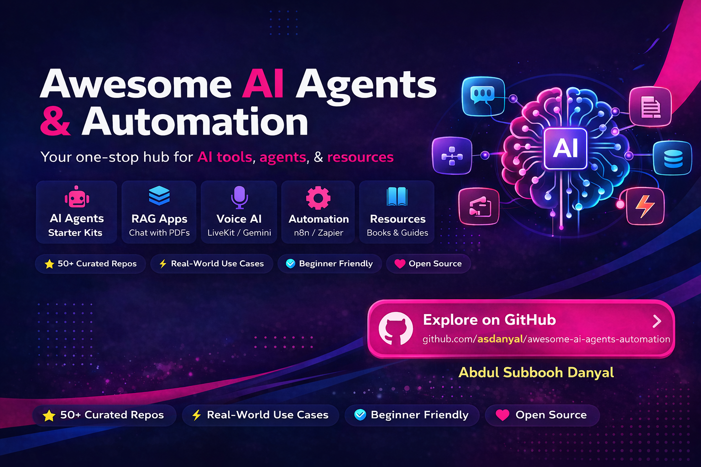

# Awesome AI Agents & Automation

A curated collection of the best AI agents, automation tools, and real-world use cases.

Built for developers, builders, and founders who want to **learn faster, build faster, and ship real AI systems.**

---

## ⭐ Top Tools (Start Here)

- [LangChain](https://github.com/langchain-ai/langchain) — Build LLM-powered applications  
- [CrewAI](https://github.com/joaomdmoura/crewai) — Multi-agent orchestration  
- [LangGraph](https://github.com/langchain-ai/langgraph) — Stateful AI workflows  
- [PrivateGPT](https://github.com/imartinez/privateGPT) — Chat with your documents  
- [n8n](https://github.com/n8n-io/n8n) — Workflow automation platform  

---

## 🧠 What You'll Find Here

- 🤖 AI Agent Frameworks (LangChain, CrewAI, LangGraph)  
- 🔍 RAG Apps (Chat with PDFs, enterprise search)  
- 🎙️ Voice AI (STT, TTS, real-time agents)  
- ⚙️ Automation (n8n, Zapier, workflows)  
- 📚 Learning Resources (books, courses, guides)  
- 🔥 Real-world use cases & projects  

---

## 🤖 AI Agent Frameworks

- [LangChain](https://github.com/langchain-ai/langchain) — Build LLM-powered apps  
- [CrewAI](https://github.com/joaomdmoura/crewai) — Multi-agent systems  
- [LangGraph](https://github.com/langchain-ai/langgraph) — Stateful workflows  
- [AutoGen](https://github.com/microsoft/autogen) — Multi-agent conversations  
- [LlamaIndex](https://github.com/jerryjliu/llama_index) — Data framework for LLM apps  
- [Semantic Kernel](https://github.com/microsoft/semantic-kernel) — AI orchestration SDK  
- [AgentGPT](https://github.com/reworkd/AgentGPT) — Run autonomous AI agents in your browser  
- [AutoGPT](https://github.com/Torantulino/Auto-GPT) — Fully autonomous AI agent framework  

---

## 🔍 RAG Apps

- [PrivateGPT](https://github.com/imartinez/privateGPT) — Chat with your documents  
- [GPT4-PDF](https://github.com/mayooear/gpt4-pdf-chatbot) — Chat with PDFs  
- [Quivr](https://github.com/StanGirard/quivr) — Personal knowledge base  
- [Embedchain](https://github.com/embedchain/embedchain) — Build RAG apps fast  
- [RAGFlow](https://github.com/infiniflow/ragflow) — Advanced RAG pipelines  
- [AnythingLLM](https://github.com/Mintplex-Labs/anything-llm) — Full-stack AI app for RAG and document chat  

---

## 🎙️ Voice AI

- [LiveKit](https://github.com/livekit/livekit) — Real-time voice infrastructure  
- [Whisper](https://github.com/openai/whisper) — Speech-to-text  
- [Coqui TTS](https://github.com/coqui-ai/TTS) — Text-to-speech  
- [Vocode](https://github.com/vocodedev/vocode-core) — Voice agents framework  
- [Pipecat](https://github.com/pipecat-ai/pipecat) — STT/TTS pipelines  

---

## ⚙️ Automation

- [n8n](https://github.com/n8n-io/n8n) — Open-source workflow automation  
- [Activepieces](https://github.com/activepieces/activepieces) — No-code automation  
- [Windmill](https://github.com/windmill-labs/windmill) — Developer workflows  
- [Huginn](https://github.com/huginn/huginn) — Automation agents  
- [Zapier Platform](https://github.com/zapier/zapier-platform) — Integration platform  

---

## 🧰 LLM Tools & Utilities

- [Ollama](https://github.com/ollama/ollama) — Run LLMs locally  
- [Open Interpreter](https://github.com/OpenInterpreter/open-interpreter) — Code execution agent  
- [Guidance](https://github.com/guidance-ai/guidance) — Structured prompting  
- [Instructor](https://github.com/jxnl/instructor) — Structured outputs  
- [Flowise](https://github.com/FlowiseAI/Flowise) — Visual LLM builder  
- [Flowise](https://github.com/FlowiseAI/Flowise) — Visual drag-and-drop LLM app builder  
- [Dify](https://github.com/langgenius/dify) — Build AI apps with workflows and RAG  

---

## 🔍 Vector Databases

- [FAISS](https://github.com/facebookresearch/faiss) — Similarity search  
- [Weaviate](https://github.com/weaviate/weaviate) — Vector database  
- [Qdrant](https://github.com/qdrant/qdrant) — High-performance vector DB  
- [Milvus](https://github.com/milvus-io/milvus) — Scalable embeddings  
- [Chroma](https://github.com/chroma-core/chroma) — Embedding database  

---

## 📚 Learning Resources

- [Prompt Engineering Guide](https://github.com/dair-ai/Prompt-Engineering-Guide) — Learn prompting  
- [LLM Course](https://github.com/mlabonne/llm-course) — End-to-end LLM learning  
- [Awesome LLM](https://github.com/Hannibal046/Awesome-LLM) — Curated resources  
- [ML Papers](https://github.com/dair-ai/ML-Papers-of-the-Week) — Weekly papers  
- [FastAI](https://github.com/fastai/fastai) — Practical deep learning  

---

## Top 10 Must Build AI Projects

- AI Email Marketing Agent — Generate and send personalized emails  
- LinkedIn Content Generator — Hooks + posts generator  
- Chat with PDFs — RAG-based document Q&A  
- Resume Optimizer — Improve resumes using AI  
- Voice AI Assistant — Real-time speech interaction  
- Meeting Notes → Tasks — Convert meetings into action items  
- YouTube Trend Analyzer — Find viral content ideas  
- Brand Monitoring Agent — Track mentions and sentiment  
- Customer Support Bot — Automated responses using RAG  
- AI Research Agent — Multi-agent research workflows  

## 🔥 Real Use Cases

- AI Email Marketing Agent  
- LinkedIn Content Generator  
- YouTube Trend Analyzer  
- Resume Optimization System  
- Meeting Notes → Tasks Automation  

---

## 💡 Why This Repo?

Most AI resources are scattered.

This repo brings everything into one place so you can:

→ Learn faster  
→ Build faster  
→ Skip beginner mistakes  

---

## 🚀 Contribute

Found something useful?

Feel free to open a PR or suggest resources.

---

## 🌐 Connect with Me

I share AI agents, automation systems, and real-world builds.

- 💼 [LinkedIn](https://www.linkedin.com/in/asdanyal-ai/)  
- 📘 [Facebook](https://www.facebook.com/asdanyalai/)  
- 📸 [Instagram](https://www.instagram.com/asdanyal.ai/)  
- ▶️ [YouTube](https://www.youtube.com/@asdanyal-ai)  

---

⭐ If you find this repo useful, consider giving it a star!

I’ll keep updating this repo daily.

Follow me for more AI resources.